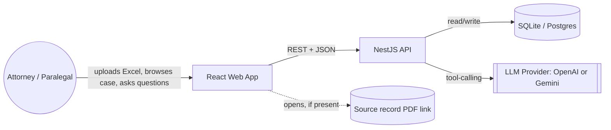
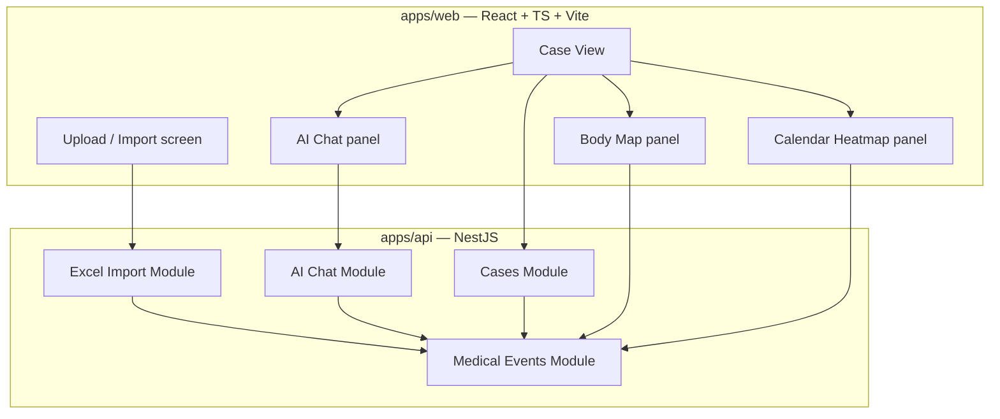
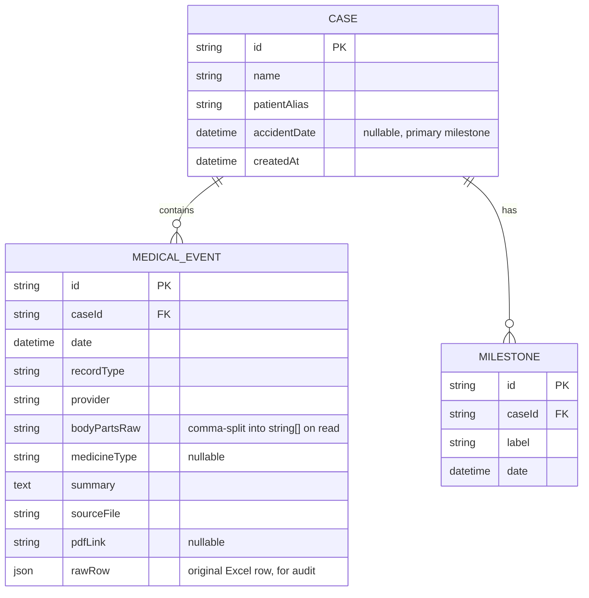

# Architecture — Medical Timeline AI

> 🗺️ [[MOC|Map of Content]]

**Status:** Proposed
**Date:** 2026-07-29
**Related docs:** [`Medical-timeline-MVP-plan.md`](../Medical-timeline-MVP-plan.md), [`Medical-Timeline-Phase1-Implementation-Plan.md`](../Medical-Timeline-Phase1-Implementation-Plan.md), [`PRD-Overview.md`](./PRD-Overview.md), [`PRD-Timeline-View.md`](./PRD-Timeline-View.md), UI reference prototype: [`UI Concepts/v7_bodymap_calendar_split.html`](../UI%20Concepts/v7_bodymap_calendar_split.html)

## 1. Purpose & Background

Medical Timeline AI turns a structured Excel export of a personal-injury case's medical encounters into an interactive treatment timeline for attorneys, built for the Swans Applied AI Hackathon brief (Sintra, 24 Jul 2026) and continued here as a real MVP.

The hackathon's core ask: *"Build an app that digests an Excel of structured medical events and produces a visual, usable timeline of the client's treatment."* The one hard rule: the app must work with **any** Excel in the given column format, not just the sample case — no hardcoded values, no hardcoded body-part vocabulary, no hardcoded provider names.

During UI exploration we prototyped seven standalone timeline concepts (`UI Concepts/v1`–`v7`). **v7 — Body Map + Calendar Split — is the concept selected for the MVP** and this document, along with `PRD-Timeline-View.md`, formalizes it into buildable requirements. Section 5 explains why.

## 2. Goals & Non-Goals

**Goals**
- Import any Excel matching the known column schema (`Encounter Date`, `Primary Provider`, `Facility`, `Body Parts`, `Medicine Type`, `Record Type`, `Summary`, `Link To Pdf`) and render it as a case in under a few seconds.
- Give an attorney two complementary, synchronized readings of the same case in one screen: **where** the client was hurt (Body Map) and **when** treatment happened, including gaps (Calendar Heatmap).
- Let an attorney add the one fact the Excel never contains — the accident date — and see it reflected across the whole view.
- Answer natural-language questions about the case (`When was the first MRI?`) using tool-calling grounded in the actual data, never the model's memory.
- Be a "keeper" per the hackathon scorecard: something its intended user (a trial attorney or paralegal) would actually use again after the demo.

**Non-goals (MVP / Phase 1)**
- Multi-user auth, roles, or firm-wide case libraries (see `PRD-Case-Management.md` §5 for the Phase 2 path).
- Real PDF/PPTX export (Phase 1 ships the buttons as clearly-labeled placeholders; Phase 2 wires them up, see `Medical-timeline-MVP-plan.md` Phase 2).
- Semantic/vector search (Phase 1 uses a keyword-match stub tool; RAG is a Phase 2 addition).
- OCR / PDF ingestion — the Excel is already-digested structured data; that step is explicitly out of scope per the hackathon brief.

## 3. System Context



The system is a single web app with a thin backend. There is no third-party integration in Phase 1 beyond the LLM provider — deliberately, since the brief rewards a focused, working submission over breadth.

## 4. High-Level Component Architecture



Module responsibilities are unchanged from `Medical-timeline-MVP-plan.md` / `Medical-Timeline-Phase1-Implementation-Plan.md` §3. What's new here is that **Case View** is no longer a generic "timeline component" — it is specifically the Body Map + Calendar split, detailed in `PRD-Timeline-View.md`.

## 5. Decision: Body Map + Calendar Split as the Primary Timeline UI

The original MVP plan named the timeline component generically ("Timeline visualization — vis-timeline / custom"). Seven concepts were prototyped and demoed as static HTML: a narrative vertical timeline, a horizontal density swimlane, a case dashboard, an anatomical body map, a presentation-style story deck, and a calendar heatmap. The body map (v4) and calendar heatmap (v6) were combined into a 50/50 split (v7) and selected as the MVP's primary view.

| Dimension | Assessment |
|---|---|
| Speaks to the hackathon's "feel it in 30 seconds" judging criterion | High — body location and time density are the two facts a jury/adjuster grasps fastest, with no reading required |
| Reuses existing generic timeline widgets (vis-timeline) | No — custom-built (SVG hotspots + CSS grid calendar), more build effort than dropping in a library |
| Generalizes to any Excel in the schema | Yes, by design — unmapped body-part vocabulary falls back to an "Other findings" list instead of breaking (§7.2) |
| Covers both attorney asks "show before/after the crash" and "flag the gaps" | Yes — accident-date marker on both panels; calendar gap visibility is the panel's whole point |
| Implementation risk | Medium — two custom visualizations instead of one library integration |

**Decision:** build the Body Map + Calendar split as the flagship Case View for MVP. The other five concepts remain in `UI Concepts/` as validated alternatives and are good fast-follow candidates (the Story Deck in particular, for court/insurer presentation mode) but are not in MVP scope. Full interaction spec: `PRD-Timeline-View.md`.

## 6. Data Model



This matches `Medical-Timeline-Phase1-Implementation-Plan.md` §1, with one addition driven by the Timeline View: `accidentDate` is promoted to a first-class field on `Case` (not only a generic `Milestone` row) because both panels read it on every render and it is the one milestone the UI treats specially (red marker, shading, ring highlight). Additional milestones (e.g. "Surgery Date") still use the generic `Milestone` table.

Index `MedicalEvent` on `(caseId, date)` and on `(caseId, bodyPartsRaw)` — the Body Map panel's per-part queries are the second-most frequent read pattern after the full case load.

## 7. Frontend Architecture

### 7.1 Component tree (Case View)

```
CaseView
├── CaseHeader            (case name, upload-different-excel, export buttons)
├── StatsBar               (encounters, span, providers, body parts, active days)
├── SharedToolbar
│   ├── AccidentDatePicker (writes Case.accidentDate via PATCH /cases/:id/milestones)
│   ├── BodyViewToggle     (front / back — local UI state only)
│   └── CalendarColorToggle(intensity / medicine type — local UI state only)
├── SplitLayout
│   ├── BodyMapPanel
│   │   ├── FigureSvg + HotspotLayer
│   │   ├── OtherFindingsChips
│   │   └── BodyPartPopup  (see 7.2)
│   └── CalendarPanel
│       ├── ActivityStrip
│       ├── MonthGrid[]
│       └── DayPopover
└── ChatPanel               (PRD-AI-Chat.md; docked below or beside the split on wide viewports)
```

### 7.2 Body Map data flow and the generic-Excel requirement

The hackathon's one hard rule — works with any Excel, not just the sample — is enforced in the frontend at the body-part-to-figure mapping layer, not in the backend. The backend has no concept of "where on a body a term goes"; it only returns event data with whatever `bodyParts` strings the source Excel contained.

- Ship a static coordinate lookup, `apps/web/src/config/bodyPartCoordinates.ts`, mapping a curated set of ~30 common anatomical terms (Head, Neck, Shoulder, Arm, Hand, Back, Spine, Leg, Foot, etc. — the full set validated against the sample case is in `PRD-Timeline-View.md` Appendix A) to figure coordinates and a front/back visibility flag.
- At render time, group the case's events by `bodyPart`, split into `known` (present in the lookup) and `unknown` (not present).
- `known` parts render as sized/colored hotspots on the SVG figure.
- `unknown` parts render as chips in an "Other findings" list below the figure — **not dropped, not erroring** — and are equally clickable into the same detail popup.
- This lookup is a pure config file, versioned and extendable without touching component logic — if a future case uses vocabulary like "Cervical Spine" instead of "Neck," the fix is a one-line addition to the config, not a rewrite.

### 7.3 State management

- Server state (case, events, statistics) via TanStack Query, keyed by `caseId` — matches `Medical-Timeline-Phase1-Implementation-Plan.md` §6.
- UI-only state (selected body part, popup open/closed, front/back toggle, calendar color mode, chat highlight target) stays local to `CaseView`, not synced to the backend — it is view state, not case data.
- The accident date is the one piece of state that is both: entering it updates local state immediately (optimistic) and persists via `PATCH /cases/:id/milestones`, so both panels reflect it instantly without waiting on a round trip.

### 7.4 Rendering approach

- **Body Map:** inline SVG figure (front and back variants share the same silhouette; only the visible hotspot set changes) with hotspots as absolutely-positioned DOM elements over the SVG, sized by `radius = f(encounterCount)` and colored by the dominant `medicineType` for that part. This avoids SVG re-layout cost on filter changes — only the hotspot layer re-renders.
- **Calendar:** CSS Grid for both the GitHub-style activity strip (`grid-auto-flow: column`, 7 fixed rows) and the month grids (`grid-template-columns: repeat(7, 1fr)`). No canvas/WebGL needed at this data scale (validated against a 130-event, 514-day case).
- **Popup vs. popover — a deliberate distinction**, carried over from the prototype and required behavior, not a bug to "fix" during implementation:
  - Body Map detail is a **popup scoped to the Body Map pane**: absolutely positioned within that pane's container at `90%` width and `90%` height, dimming only that pane. See `PRD-Timeline-View.md` §6 for exact acceptance criteria.
  - Calendar day detail is a **small popover anchored near the click point**, positioned in viewport (fixed) coordinates, dimming the full screen. Kept distinct because a day's event list is usually short (rarely more than a handful of same-day encounters) and doesn't need the larger surface a body part with dozens of encounters does.

## 8. Backend Architecture

Unchanged in shape from `Medical-Timeline-Phase1-Implementation-Plan.md` §3–§5: `CasesModule`, `MedicalEventsModule`, `ExcelImportModule`, `AiChatModule`, controller → service → repository layering, tool-calling orchestrator with a hard cap on iterations, and the grounding rule ("the model must never state a fact that didn't come from a tool result").

One addition driven by the Timeline View: `MedicalEventsModule` needs an efficient **group-by** query in addition to the existing `findByFilters`:

```
GET /cases/:id/events/grouped-by-body-part
GET /cases/:id/events/grouped-by-day
```

Both panels currently group client-side in the prototype (fine at 130 rows); for cases with several thousand rows, grouping in SQL (`GROUP BY`) rather than shipping every row to the browser keeps the initial Case View load fast. This is a Phase 1 nice-to-have if a large seeded case is used in the demo, otherwise Phase 1.5.

## 9. API Contract (delta from Phase 1 plan)

The REST contract in `Medical-Timeline-Phase1-Implementation-Plan.md` §4 stands. Additions for the Timeline View:

```
GET  /cases/:id/events/grouped-by-body-part   -> { bodyPart, count, dominantMedicineType, eventIds[] }[]
GET  /cases/:id/events/grouped-by-day         -> { date, count, dominantMedicineType, eventIds[] }[]
PATCH /cases/:id/milestones                   { label: "accidentDate", date } -> Case
```

`accidentDate` is still stored via the generic milestones endpoint (§6) — no new endpoint needed, just a documented convention that `label: "accidentDate"` is the one the frontend treats specially.

## 10. Data Flow — Key Sequences

**Import → render:**

```mermaid
sequenceDiagram
    participant U as Attorney
    participant W as Web App
    participant A as API
    participant D as DB
    U->>W: Upload Excel
    W->>A: POST /cases/import (multipart)
    A->>A: Parse, validate, normalize
    A->>D: Insert Case + MedicalEvent rows (transaction)
    A-->>W: { caseId, importSummary }
    W->>A: GET /cases/:id/events, /statistics
    A->>D: Query
    D-->>A: rows
    A-->>W: events, statistics
    W->>W: Group by body part (known/unknown) and by day; render Body Map + Calendar
```

**AI chat with cross-panel highlight:**

```mermaid
sequenceDiagram
    participant U as Attorney
    participant W as Web App
    participant A as AI Chat Module
    participant L as LLM
    participant E as Medical Events Module
    U->>W: "When was the first MRI?"
    W->>A: POST /cases/:id/chat
    A->>L: message + tool schemas
    L-->>A: tool call find_events(keyword="MRI")
    A->>E: findByFilters(...)
    E-->>A: matching events
    A->>L: tool result
    L-->>A: grounded final answer
    A-->>W: { reply, referencedEventIds }
    W->>W: Highlight referenced day(s) on Calendar; flash matching hotspot(s) on Body Map
```

The highlight behavior is new relative to the Phase 1 plan's chat section (which only mentioned "timeline highlights referenced events" generically) — with two panels, a chat reference now needs to resolve to *both* a calendar day and, if the event has body parts, a body-map hotspot. Detailed in `PRD-AI-Chat.md` §6.

## 11. Deployment View

Hackathon/MVP-appropriate, not production-hardened:

- `apps/web` → static build, deployed to Vercel or Netlify.
- `apps/api` → single container (NestJS), deployed to Fly.io, Render, or similar; SQLite file on a persistent volume for the demo, swappable to managed Postgres via the same TypeORM/Prisma driver with no code change (per `Medical-Timeline-Phase1-Implementation-Plan.md` §0).
- LLM calls go directly from the API to the provider (OpenAI or Gemini) — no proxy layer needed at this scale.
- Local dev: `docker-compose up` for API + DB, `npm run dev` for the Vite frontend, matching the monorepo layout already specified.

## 12. Security & Privacy

This app handles medical records for active litigation — treat as sensitive by default even in a hackathon/demo context.

- **Data retention is a decision to make explicitly, not default into.** The hackathon submission checklist requires disclosing "where data goes, if anywhere," and states client-side-only, lost-on-refresh is a perfectly valid answer. For MVP, default to: uploaded Excel and derived events are persisted server-side only for the duration of the session/demo case (SQLite file, not backed up, not shared across deployments); document this plainly in the submission and in a `PRIVACY.md` if the project continues past the hackathon.
- Never log full `summary` text or `rawRow` content — these contain PHI. Structured logs should reference `eventId`, not medical content.
- The LLM provider receives only the data the tool-calling loop explicitly sends (event summaries relevant to the user's question), not the full case dump on every turn — keep tool result payloads scoped to what the tool call asked for.
- API keys (`OPENAI_API_KEY` / `GEMINI_API_KEY`) server-side only, never exposed to the frontend bundle.
- No auth in Phase 1 (single-case-per-session assumption, `PRD-Case-Management.md` §2) — this must be called out as an explicit limitation in the submission's assumptions list, not silently shipped.

## 13. Non-Functional Requirements

| Requirement | Target |
|---|---|
| Excel import (≤200 rows) | Parsed, persisted, and Case View rendered in < 3s end-to-end |
| Case View initial render (≤200 events) | < 1s from data-ready to interactive |
| Body Map popup open | < 150ms (client-side filter of already-loaded events, no round trip) |
| Calendar day popover open | < 150ms, same reasoning |
| AI chat response | < 8s for a single tool-call round trip (cap orchestrator at ~4 iterations per `Medical-Timeline-Phase1-Implementation-Plan.md` §5) |
| Browser support | Latest Chrome/Edge/Safari/Firefox; no IE/legacy support needed |
| Responsive breakpoint | Split layout stacks vertically below ~860px viewport width (validated in prototype) |

## 14. Key Architectural Decisions

| # | Decision | Alternative considered | Why this way |
|---|---|---|---|
| 1 | React+TS+Vite / NestJS+TS / SQLite→Postgres | Full-stack framework (Next.js) | Matches existing MVP plan; clean separation keeps the tool-calling orchestrator testable in isolation |
| 2 | Tool-calling over RAG for Phase 1 | Vector search from day one | Case sizes are small (tens to low-hundreds of rows); structured queries are cheaper, faster, and easier to keep grounded. RAG deferred to Phase 2 for open-ended semantic questions |
| 3 | Body Map + Calendar Split as primary Case View | Generic vis-timeline gantt (original plan's placeholder) | Directly serves the "feel it in 30 seconds" judging criterion from two angles (location + density) that a generic gantt doesn't provide; validated via working prototype |
| 4 | Body-part-to-figure mapping as static frontend config, with an explicit "unmapped" fallback path | Server-side or ML-based body-part classification | Keeps the hard "any Excel" requirement satisfied without new infrastructure; unmapped terms degrade gracefully instead of breaking |
| 5 | SQLite for MVP | Postgres from day one | Zero local setup; driver-level swap to Postgres already designed in, no schema rework |
| 6 | No auth / single case per session for Phase 1 | Multi-tenant auth from day one | Matches hackathon demo scope; explicitly flagged as a Phase 1 limitation, not a silent gap |

## 15. Risks & Mitigations

| Risk | Mitigation |
|---|---|
| Real-world Excels use body-part vocabulary far outside the curated coordinate map | "Other findings" fallback (§7.2) keeps the app functional; track unmapped-term frequency in the demo case pool to grow the config over time |
| A case with a very long span (multi-year) makes the calendar's month-grid list unwieldy | Acceptable for MVP (validated up to 17 months / 18 month-cards with scroll); revisit with a collapsed year view if a real case exceeds ~24 months |
| LLM hallucinating facts not backed by a tool call | System prompt grounding rule + spot-check script against known answers before every demo (`Medical-Timeline-Phase1-Implementation-Plan.md` §8) |
| Judges/users load an unfamiliar Excel at demo time and something breaks | Import validator returns row/column-level errors instead of a generic failure (`PRD-Excel-Import.md` §4); test against at least one deliberately "messy" fixture file before the demo |

## 16. Open Questions

Carried over from `Medical-Timeline-Phase1-Implementation-Plan.md` §9, plus new ones from this integration:

- Exact Excel column headers/format for real (non-sample) source files — confirm the schema-mapping config covers observed variance.
- OpenAI vs Gemini for function calling — affects tool-schema format and SDK choice.
- Single-case-per-session demo vs. multi-case/multi-user with auth — see `PRD-Case-Management.md` §5.
- Should the body-part coordinate config eventually move server-side (e.g. to support per-firm custom vocabularies) — deferred until there's evidence it's needed.
- Do we need a "Front/Back" figure distinction at all if very few cases populate posterior-only terms (Back, Upper Back, Spine) — keep for now since the sample case uses all three, revisit with more case data.
