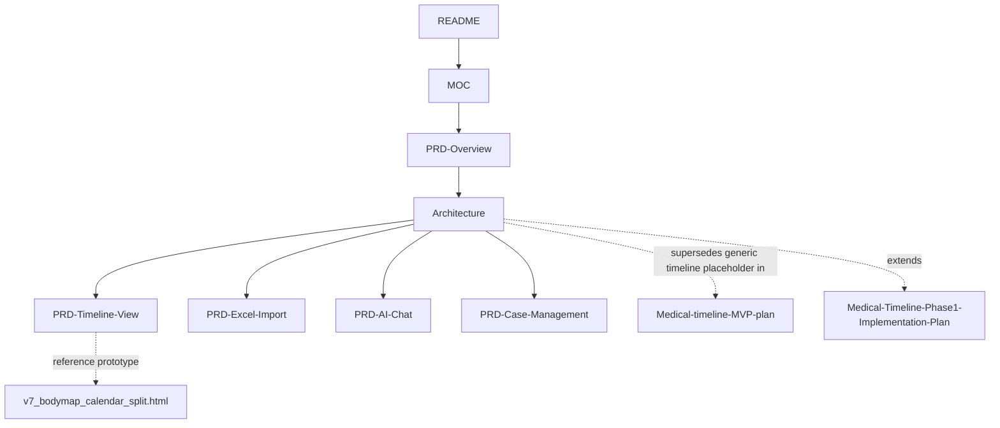

# 🗺️ Map of Content — Medical Timeline AI

Central index for this project's planning docs, requirements, and design artifacts. Start anywhere below — every note links back here.

## 🏠 Start Here

- [[README]] — what this project is, in brief
- [[PRD-Overview]] — the problem, who it's for, and what "done" means for the MVP
- [[Progress]] — audited status: what's built, what's stubbed, gaps vs. these PRDs

## 🏗️ Planning & Architecture

- [[Medical-timeline-MVP-plan]] — original two-phase MVP plan (Phase 1 core product, Phase 2 automation/n8n)
- [[Medical-Timeline-Phase1-Implementation-Plan]] — detailed Phase 1 build plan (data model, modules, API, sprints)
- [[Architecture]] — current system architecture: component diagram, data model, API contract, data flow, security, key decisions

## 📋 Product Requirements (PRDs)

| Doc | Covers |
|---|---|
| [[PRD-Overview]] | Problem, personas, success metrics, MVP scope, definition of done |
| [[PRD-Timeline-View]] | The flagship Case View — Body Map + Calendar split, layout, popup/popover specs, acceptance criteria |
| [[PRD-Excel-Import]] | Upload → validate → parse → normalize → persist pipeline |
| [[PRD-AI-Chat]] | Tool-calling Q&A, grounding rule, cross-panel highlight behavior |
| [[PRD-Case-Management]] | Case creation, milestones (accident date), single-case-per-session scope |

## 🎨 UI Prototypes (`UI Concepts/`)

Seven self-contained, working HTML prototypes, each pre-loaded with the real sample case and each able to load any Excel of the same column format via upload.

| # | Concept | Notes |
|---|---|---|
| [v1 — Case Story](../UI%20Concepts/v1_case_story.html) | Narrative vertical timeline | Filters, milestone marker, mock Q&A |
| [v2 — Visual Density](../UI%20Concepts/v2_visual_density.html) | Horizontal swimlane / Gantt | Density-at-a-glance, jury/adjuster framing |
| [v3 — Command Center](../UI%20Concepts/v3_command_center.html) | Dashboard / explorer | Groupable list, AI draft-summary, mock case switcher |
| [v4 — Body Map](../UI%20Concepts/v4_body_map.html) | Anatomical hotspots | Front/back toggle, "Other findings" fallback |
| [v5 — Story Deck](../UI%20Concepts/v5_story_deck.html) | Presentation / slideshow | Auto-chaptered by treatment gaps |
| [v6 — Calendar Heatmap](../UI%20Concepts/v6_calendar_heatmap.html) | GitHub-style density calendar | Activity strip + month grids |
| [v7 — Body Map + Calendar Split](../UI%20Concepts/v7_bodymap_calendar_split.html) ⭐ | v4 + v6 combined, 50/50 | **Selected for MVP** — see [[PRD-Timeline-View]] and [[Architecture]] §5 |

## 🔗 How the docs relate

`Architecture.md` is the hub for implementation-level decisions; the PRDs are the hub for requirements and acceptance criteria; the two original plan docs are the historical starting point everything else refines.

## ✅ Suggested reading order

1. [[README]] → [[PRD-Overview]] — orient on the problem and scope.
2. [[Architecture]] — see how it's built and why the Body Map + Calendar split was chosen.
3. [[PRD-Timeline-View]] — the detailed spec for that flagship view.
4. [[PRD-Excel-Import]], [[PRD-AI-Chat]], [[PRD-Case-Management]] — the remaining modules, any order.
5. Open the [v7 prototype](../UI%20Concepts/v7_bodymap_calendar_split.html) in a browser alongside [[PRD-Timeline-View]] to see the spec matched against working code.
